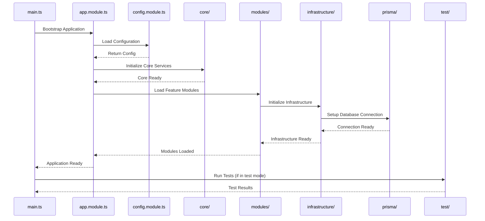

# Regras do Projeto

## Índice
1. [Regras Gerais](#regras-gerais)
2. [Regras de Código](#regras-de-código)
3. [Regras de Git](#regras-de-git)
4. [Regras de Documentação](#regras-de-documentação)

## Estrutura do Projeto

## Regras Gerais

## Regras de Código
1. Não utilizar comentários no código. O código deve ser autoexplicativo através de nomes de variáveis, funções e classes bem definidos.

## Regras de Git

## Regras de Documentação 
